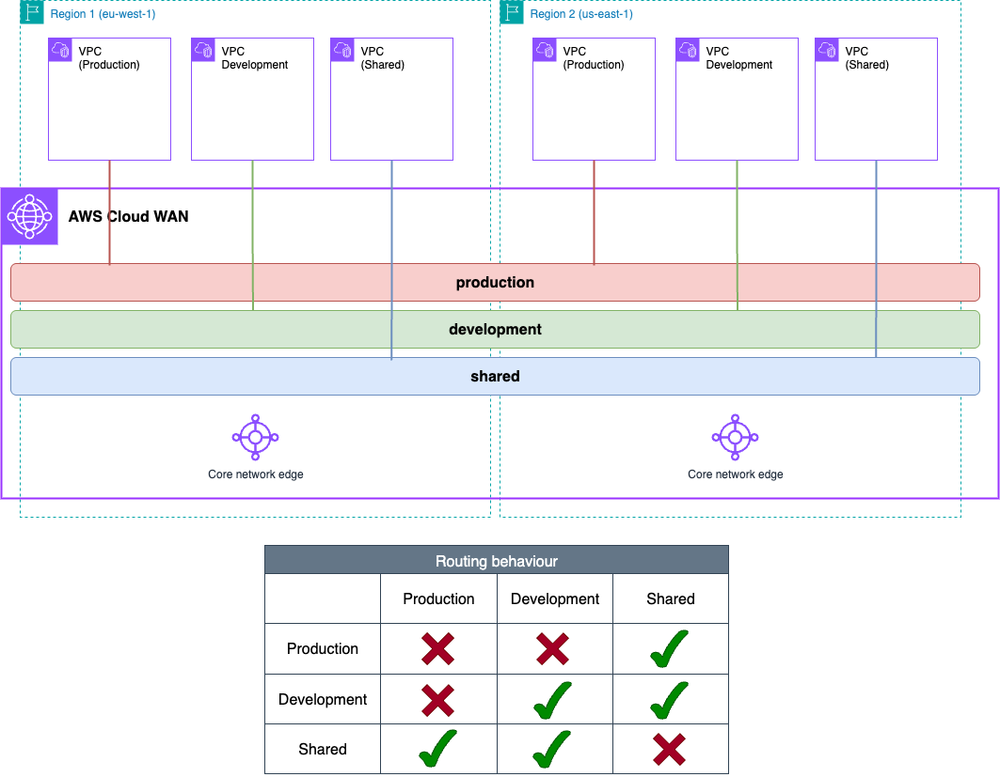

# Infrastructure-as-Code Patterns — Basic AWS Cloud WAN network

In this pattern, we want to show a simple AWS Cloud WAN implementation - focusing on how VPCs connect to a core network. Having multiple VPCs per Region, users can test global traffic segmentation, communication between segments, and segment isolation.

## Implementations

| IaC | Directory |
|-----|-----------|
| Terraform | [`terraform/`](./terraform/) |
| CloudFormation | [`cloudformation/`](./cloudformation/) |

> New to the repository? Read [`../README.md`](../README.md) first.

## What gets deployed

| Component | Configuration |
|-----------|---------------|
| AWS Regions | `us-east-1`, `eu-west-1` |
| AWS Cloud WAN resources | Global network & core network |
| Spoke VPCs | Three per Region — `prod`, `dev`, `shared` — each with three subnet tiers, one of them for the Cloud WAN attachment |
| Compute | An EC2 instance in every configured Availability Zone, plus an EC2 Instance Connect endpoint per VPC |

**Attachment types created:** `vpc` only.

Each attachment is tagged, and those tags are all a policy has to match on:

| VPC | Tag on its Cloud WAN attachment |
|-----|---------------------------------|
| `prod` | `domain = production` |
| `dev` | `domain = development` |
| `shared` | `domain = shared` |

## What the baseline policy configures

[`baseline.json`](./baseline.json) covers the two most fundamental Cloud WAN capabilities and nothing else.

| | |
|---|---|
| Segments | `production` and `development`, both non-isolated; `shared`, isolated |
| Association | Rule 100 matches `attachment-type = vpc` **and** `tag-exists: domain`, then associates by the tag's value |
| Sharing | `shared` is shared with `production` and with `development` |

Association is by **tag value**, so one attachment-policy rule handles all three segments. Any policy you deploy here must match the `domain` tag, or the VPCs will attach and never associate.

Resulting reachability:

| Source | Destination | Result | Why |
|--------|-------------|--------|-----|
| `prod` (us-east-1) | `prod` (eu-west-1) | Allowed | Same segment, non-isolated, and segments are global |
| `dev` (us-east-1) | `dev` (eu-west-1) | Allowed | Same segment, non-isolated |
| `prod` | `shared` | Allowed | `shared` is shared with `production` |
| `dev` | `shared` | Allowed | `shared` is shared with `development` |
| `shared` | `shared` (other Region) | Blocked | `shared` is isolated, so its attachments cannot reach each other |
| `prod` | `dev` | Blocked | No sharing declared between `production` and `development` |

Isolation blocks traffic *within* a segment, and segments never reach each other unless a `share` action says so — sharing is explicit and non-transitive. See [`policy/2-segments.md`](../../policy/2-segments.md) and [`policy/4-segment_sharing.md`](../../policy/4-segment_sharing.md).

## Verifying it works

1. In the AWS Network Manager console, confirm the six VPC attachments are `AVAILABLE` **and** associated with the segment matching its `domain` tag.
2. Connect to an instance with EC2 Instance Connect — the endpoint sits in each VPC's endpoints subnet.
3. Work through the reachability table above with `ping`. The security groups allow ICMP.

> **Deployed a policy of your own?** Steps 1 and 2 still apply — every attachment has to be `AVAILABLE` and associated where you expect. Step 3 does not: that table describes the baseline, so derive your own expectations from the segments and `share` actions you wrote. Beyond reachability, what to check depends on the capabilities you used, and the [`policy/`](../../policy/) pages cover them.

If an attachment is `AVAILABLE` but shows no segment, the `domain` tag and the policy's attachment policies disagree — the most common Cloud WAN misconfiguration. See [`policy/3-attachment_policies.md`](../../policy/3-attachment_policies.md).

## Cost

| Resource | Count | Charged |
|----------|-------|---------|
| Core Network Edge | 2, one per Region | Hourly |
| VPC attachment | 6 | Hourly, per attachment |
| EC2 instance | One per configured Availability Zone of every VPC | Hourly |
| EC2 Instance Connect endpoint | 6, one per VPC | Hourly |

Use a non-production account and run the cleanup steps in the IaC README when you are finished.
