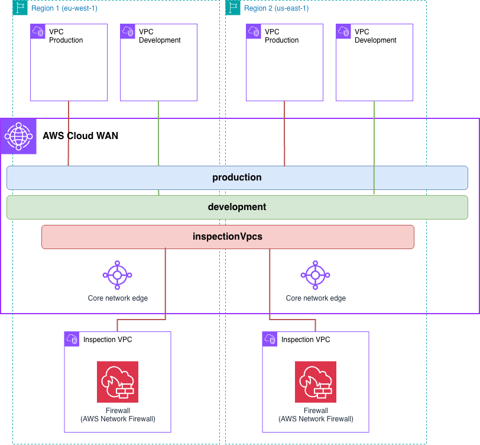

# Infrastructure-as-Code Patterns — AWS Cloud WAN with traffic inspection

In this pattern, we want to show how AWS Cloud WAN steers traffic through a firewall using service insertion. Users can test egress (internet-bound) inspection, east-west inspection between segments, and how segment isolation behaves when only some traffic is inspected.

## Implementations

| IaC | Directory |
|-----|-----------|
| Terraform | [`terraform/`](./terraform/) |
| CloudFormation | [`cloudformation/`](./cloudformation/) |

> New to the repository? Read [`../README.md`](../README.md) first.

## What gets deployed

| Component | Configuration |
|-----------|---------------|
| AWS Regions | `us-east-1`, `eu-west-1` |
| AWS Cloud WAN resources | Global network & core network |
| Spoke VPCs | Two per Region — `prod`, `dev` — each with three subnet tiers, one of them for the Cloud WAN attachment |
| Inspection VPC | One per Region — with public, inspection and Cloud WAN attachment subnets, an internet gateway, and a NAT gateway in each Availability Zone |
| AWS Network Firewall | One per Inspection VPC, with a firewall endpoint in each Availability Zone |
| Compute | An EC2 instance in every configured Availability Zone of each spoke VPC, plus an EC2 Instance Connect endpoint per spoke VPC |

**Attachment types created:** `vpc` only — for the spoke VPCs and for the Inspection VPCs.

Each attachment is tagged, and those tags are all a policy has to match on:

| VPC | Tag on its Cloud WAN attachment |
|-----|---------------------------------|
| `prod` | `domain = production` |
| `dev` | `domain = development` |
| Inspection VPC | `inspection = true` |

**Appliance mode is enabled** on the Inspection VPC attachments. Without it, the two directions of a flow can land on different firewall endpoints, and the one holding no state for that flow drops it.

**The firewall policy is an example**, sized to prove that traffic really is traversing the firewall:

- **Egress** allows HTTPS to `*.amazon.com` and drops everything else, so `curl https://aws.amazon.com` succeeds and any other host fails.
- **East-west** allows ICMP, so `ping` works across the inspected paths.
- SSH and RDP are dropped statelessly, before the stateful engine sees them.

For real firewall design, see the [AWS Network Firewall best practices guide](https://aws.github.io/aws-security-services-best-practices/guides/network-firewall/).

Firewall logging is not configured, because this pattern is about the Cloud WAN building blocks rather than Network Firewall operations. Network Firewall publishes [CloudWatch metrics](https://docs.aws.amazon.com/network-firewall/latest/developerguide/monitoring-cloudwatch.html) in the `AWS/NetworkFirewall` namespace on its own — `PassedPackets` and `DroppedPackets` among them, also on the firewall's **Monitoring** tab — which is enough to see which firewall handled a flow.

## What the baseline policy configures

[`baseline.json`](./baseline.json) inspects two different kinds of traffic, with two different service-insertion actions.

| | |
|---|---|
| Segments | `production`, isolated; `development`, not isolated |
| Network function group | `inspectionVpcs` — the Inspection VPC attachments join it instead of a segment |
| Association | Rule 100 puts anything tagged `inspection = true` into the network function group; rule 200 matches `attachment-type = vpc` **and** `tag-exists: domain`, then associates by the tag's value |
| Egress inspection | `send-to` on both segments, so internet-bound traffic goes through the local Region's firewall |
| East-west inspection | `send-via` on `production`, `single-hop`, scoped to traffic sent to `development`, with `with-edge-overrides` pinning cross-Region inspection to `us-east-1` |

Resulting behaviour:

| Source | Destination | Result | Inspected |
|--------|-------------|--------|-----------|
| `prod` | Internet | Allowed to `*.amazon.com` | Yes, in its own Region |
| `dev` | Internet | Allowed to `*.amazon.com` | Yes, in its own Region |
| `prod` (us-east-1) | `dev` (us-east-1) | Allowed | Yes, in `us-east-1` |
| `prod` (eu-west-1) | `dev` (eu-west-1) | Allowed | Yes, in `eu-west-1` |
| `prod` (us-east-1) | `dev` (eu-west-1) | Allowed | Yes, in `us-east-1` only |
| `prod` (eu-west-1) | `dev` (us-east-1) | Allowed | Yes, in `us-east-1` only |
| `dev` (us-east-1) | `dev` (eu-west-1) | Allowed | **No** — `development` is not isolated, so traffic goes direct |
| `prod` (us-east-1) | `prod` (eu-west-1) | **Blocked** | — |

## Verifying it works

1. In the AWS Network Manager console, confirm the two Inspection VPC attachments are `AVAILABLE` and show the `inspectionVpcs` network function group, and the four spoke attachments show the segment matching their `domain` tag.
2. Connect to an instance with EC2 Instance Connect — the endpoint sits in each spoke VPC's endpoints subnet.
3. **Egress:** from any instance, `curl https://aws.amazon.com` succeeds and `curl https://www.example.com` fails. The second one failing is the firewall doing its job.
4. Work through the reachability table above with `ping`. The security groups allow ICMP, and so does the firewall policy.
5. To see **where** a flow was inspected, compare `PassedPackets` on the two firewalls in CloudWatch, or their **Monitoring** tabs. Cross-Region `prod` to `dev` moves the counter in `us-east-1` only — that is `single-hop` with the edge override. `dev` to `dev` moves neither.

> **Deployed a policy of your own?** Steps 1 and 2 still apply — every attachment has to be `AVAILABLE` and associated where you expect. Steps 3 to 5 describe this baseline, so derive your own expectations from the segments and service-insertion actions you wrote. If traffic flows but no firewall counter moves, the inspection path is not being used: check that the segment is isolated where you rely on `send-via`, and that the action's `when-sent-to` actually covers the flow you are testing.

If a spoke attachment is `AVAILABLE` but shows no segment, its `domain` tag and the policy's attachment policies disagree — the most common Cloud WAN misconfiguration. See [`policy/3-attachment_policies.md`](../../policy/3-attachment_policies.md).

## Cost

| Resource | Count | Charged |
|----------|-------|---------|
| AWS Network Firewall | 2, one per Inspection VPC, with an endpoint per Availability Zone | Hourly per endpoint, plus data processed |
| NAT gateway | 4, two per Inspection VPC — one per Availability Zone | Hourly, plus data processed |
| Elastic IP | 4, one per NAT gateway | Hourly |
| Core Network Edge | 2, one per Region | Hourly |
| VPC attachment | 6 — four spoke, two inspection | Hourly, per attachment |
| EC2 instance | One per configured Availability Zone of every spoke VPC | Hourly |
| EC2 Instance Connect endpoint | 4, one per spoke VPC | Hourly |

Network Firewall and the NAT gateways dominate, and both charge for data processed as well as uptime, so the bill grows with how much you test. Use a non-production account and run the cleanup steps in the IaC README when you are finished.
