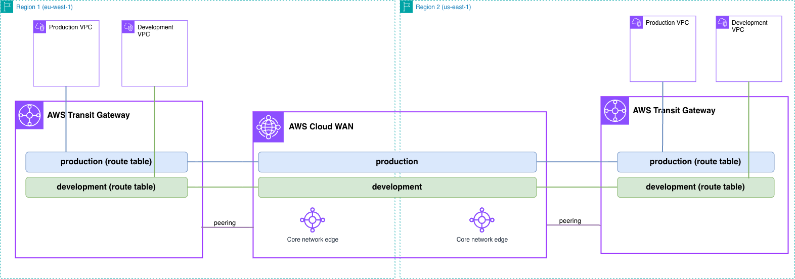

# Infrastructure-as-Code Patterns — AWS Cloud WAN with AWS Transit Gateway (AWS CloudFormation)

In this pattern, we want to show how AWS Cloud WAN connects to AWS Transit Gateway using a peering connection - and how segmentation can be configured on top of that peering. Users can test global traffic segmentation, communication between segments, and segment isolation for workloads that reach the core network through a Transit Gateway.



See [the pattern README](../README.md) for what this builds, the attachment tags it applies, what its baseline policy configures, and how to verify it.

## Prerequisites

- An AWS account with permissions for CloudFormation, Network Manager, EC2 (VPCs, subnets, instances, endpoints, Transit Gateways), and IAM.
- The AWS CLI, configured with credentials.
- `make`, which drives the stack ordering.

## Templates

| Template | Deploys | Region |
|----------|---------|--------|
| `core_network.yaml` | Global network, core network, and the policy | `us-east-1` |
| `workloads.yaml` | Spoke VPCs, Transit Gateway, route tables, Cloud WAN peering and attachments, instances | Once per Region |

## Deploy

```bash
cd infra/3-transit_gateway/cloudformation
make deploy
```

That deploys the pattern with its working baseline policy: the core network first, then the workloads in both Regions. To take it a stack at a time, `make deploy-cloudwan` then `make deploy-workloads`.

> **Using a policy of your own?** CloudFormation needs the policy **inline** in the template — `PolicyDocument` takes JSON with no file or S3 option, and a stack parameter caps at 4,096 bytes — so instead of pointing at a different file you deploy a different template. `core_network.yaml` has to keep matching [`../baseline.json`](../baseline.json), which CI compares, so copy it rather than editing it.

## Cleanup

```bash
cd infra/3-transit_gateway/cloudformation
make undeploy
```

That removes the workload stacks first, then the core network. The order matters: deleting a core network that still has attachments fails, and the error does not name the cause. To do it a stack at a time, `make undeploy-workloads` then `make undeploy-cloudwan`.
