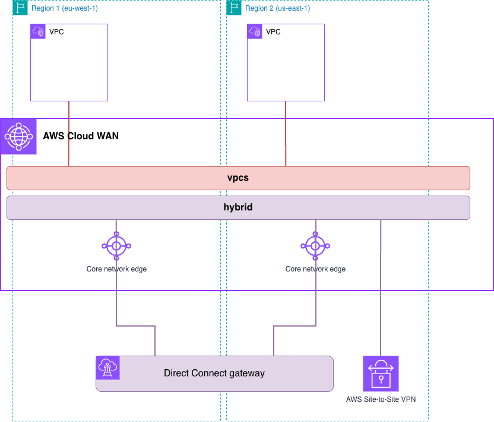

# Infrastructure-as-Code Patterns — AWS Cloud WAN with hybrid connectivity (Terraform)

In this pattern, we want to show how AWS Cloud WAN integrates with AWS Site-to-Site VPN and AWS Direct Connect to achieve hybrid connectivity.



See [the pattern README](../README.md) for what this builds, how its attachments associate, what its baseline policy configures, and how to verify it.

## Prerequisites

- An AWS account with permissions for Network Manager, EC2 (VPCs, subnets, instances, endpoints, customer gateways, VPN connections), Direct Connect, and IAM.
- The AWS CLI, configured with credentials.
- Terraform. The minimum version is in the **Requirements** table below.

## Deploy

```bash
cd infra/4-hybrid/terraform
terraform init
terraform plan
terraform apply
```

That deploys the pattern with its working baseline policy, [`../baseline.json`](../baseline.json): the core network and one spoke VPC per Region. Both hybrid attachments are off by default — enable either or both. Neither ASN may overlap the core network's `asn-ranges`, which the baseline sets to `64520-64525`.

The Site-to-Site VPN is created in `us-east-1`. Both values describe your on-premises device, so there is no default for them:

```bash
terraform apply -var 'site_to_site_vpn={customer_gateway_ip="203.0.113.10",customer_gateway_asn=65010}'
```

The Direct Connect gateway needs only its Amazon-side ASN:

```bash
terraform apply -var 'direct_connect_gateway={amazon_side_asn=64534}'
```

> **This pattern builds the AWS side only.** The VPN tunnels stay down until a real on-premises peer answers, and the Direct Connect gateway carries no traffic until you associate a Transit VIF with it — creating the Transit VIFs and their association is out of scope here. What you can verify is the integration itself: that each hybrid attachment reaches the `hybrid` segment. Testing the path end to end is yours to do.

> **Using a policy of your own?** No Terraform changes needed — `main.tf` reads whatever file `var.policy_document` points at. Drop your document in the pattern folder next to the baseline, then `terraform apply -var policy_document=../my-policy.json`. Paths are relative to this directory, which is why the default is `../baseline.json`; change that default in `variables.tf` to stop passing `-var` every time.

## Cleanup

```bash
terraform destroy
```

---

Everything below is generated from the Terraform source by `terraform-docs`. Do not edit `README.md` directly — edit [`.header.md`](./.header.md) and regenerate.
