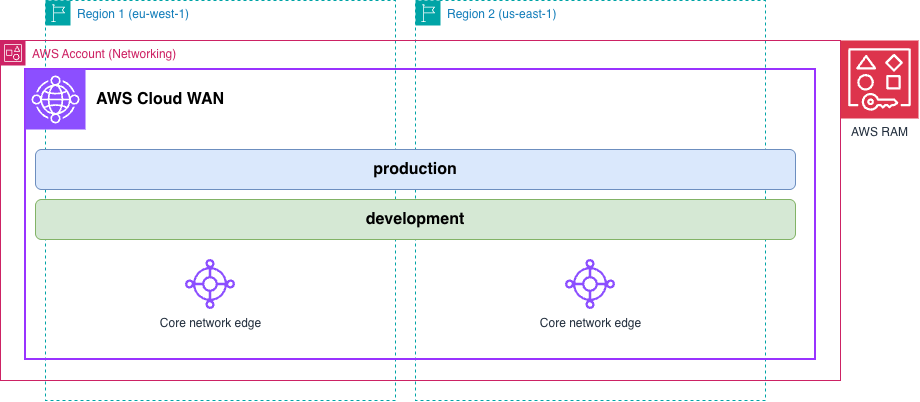

# Infrastructure-as-Code Patterns — AWS Cloud WAN shared across accounts

In this pattern, we want to show how a core network is shared with other AWS accounts using AWS Resource Access Manager.

## Implementations

| IaC | Directory |
|-----|-----------|
| Terraform | [`terraform/`](./terraform/) |
| CloudFormation | [`cloudformation/`](./cloudformation/) |

> New to the repository? Read [`../README.md`](../README.md) first.

## What gets deployed

| Component | Configuration |
|-----------|---------------|
| AWS Cloud WAN resources | Global network & core network, managed in `us-west-2` |
| AWS RAM resource share | Created in `us-east-1`, containing the core network |
| Share principal | One AWS account, organizational unit, or organization — you choose which |

**Attachment types created:** none. This is the only pattern that creates no attachments of its own. The spoke account creates them, which is what makes the attachment policy worth reading carefully.

A shared core network does not accept every attachment type. Only three of the five can be created by an account the core network is shared with - see [Shared attachments in AWS Cloud WAN](https://docs.aws.amazon.com/network-manager/latest/cloudwan/cloudwan-shared-attachments.html) for more information:

| Attachment type | From a spoke account? | Comments |
|-----------------|------------------------|----------|
| `vpc` | Yes | |
| `transit-gateway-route-table` | Yes | |
| `direct-connect-gateway` | Yes | |
| `site-to-site-vpn` | **No** | |
| `connect` | **No** | Underlay `vpc` attachment can be created in a spoke account |

The share principal takes one of three forms, and the code validates which one you gave it:

| Principal | Value | Requires |
|-----------|-------|----------|
| `account` | A 12-digit account ID | Nothing extra. Works whether or not the account is in your organization |
| `organizational_unit` | An OU ARN | RAM sharing with AWS Organizations enabled |
| `organization` | An organization ARN | RAM sharing with AWS Organizations enabled |

Enable that once, from the management account, with `aws ram enable-sharing-with-aws-organization`. Until you do, RAM accepts individual account IDs only. The forms also differ on the receiving end: an organization or OU share is **auto-accepted**, while an account share sends an invitation the spoke account has to accept.

## Why two Regions

Both Regions in this pattern are administrative. Neither is an edge location — the edge locations come from the policy document, which is why you will see `us-east-1` and `eu-west-1` there and `us-west-2` here.

**Cloud WAN's home Region is `us-west-2` (Oregon).** A core network is a global construct, and Cloud WAN aggregates and stores its state in that single home Region. Every regional Network Manager endpoint resolves to `networkmanager.us-west-2.amazonaws.com`, so this is where the global network and core network are managed from.

**AWS RAM can only share a global resource from `us-east-1` (N. Virginia).** A RAM resource share is itself a Regional object, and RAM designates one Region — `us-east-1` — as the only place a share containing global resources may be created. The AWS documentation names a Cloud WAN core network as the example. Share it from anywhere else and the call fails.

So these are two unrelated requirements that collide on the words "home Region": Cloud WAN's home Region is `us-west-2`, and the *resource share's* home Region must be `us-east-1`. The core network stays global either way, and once shared it can be used from any Region the service supports.

Both implementations show this directly. Terraform uses two provider aliases — `awscc.awsccoregon` for the global and core network, `aws.awsnvirginia` for the RAM share. CloudFormation deploys `core_network.yaml` in `us-west-2` and `ram_share.yaml` in `us-east-1`.

## What the baseline policy configures

[`baseline.json`](./baseline.json) stays close to a plain segmented core network, because the interesting part here is who creates the attachments rather than what the policy does.

| | |
|---|---|
| Segments | `production`, which **requires attachment acceptance**; `development`, which does not. Neither is isolated |
| Association | Rule 100 matches `attachment-type = vpc` **and** `tag-exists: domain`, then associates by the tag's value |
| Sharing | None declared, so the two segments cannot reach each other |

`require-attachment-acceptance` on `production` is the control that matters once a spoke account is involved. Association is driven by a `domain` tag that the **spoke account** sets on its own attachment, so a spoke tagging `domain = production` is asking to join your production segment. With acceptance required, that attachment waits for someone in the network account to approve it. On `development` it is left off, so those attachments associate immediately — the contrast is the point.

Resulting reachability, once a spoke account attaches a VPC:

| Source | Destination | Result | Why |
|--------|-------------|--------|-----|
| `production` attachment | `production` attachment, either Region | Allowed, after acceptance | Same segment, non-isolated, and segments are global |
| `development` attachment | `development` attachment, either Region | Allowed immediately | Same segment, acceptance not required |
| `production` | `development` | Blocked | No sharing declared between the segments |

## Verifying it works

1. In the AWS RAM console **in `us-east-1`**, confirm the resource share exists and lists the core network as its resource, with your principal attached. Sharing with an account sends an invitation; sharing with an OU or organization does not.
2. From the spoke account, confirm the core network is visible — `aws networkmanager list-core-networks` shows it once the share is active.
3. From the spoke account, create a VPC attachment tagged `domain = development` and confirm it associates on its own.
4. Repeat tagged `domain = production` and confirm it stays pending until the network account accepts it. `aws networkmanager list-attachments --attachment-type VPC` shows the state, and `accept-attachment` approves it.

> **Deployed a policy of your own?** Steps 1 and 2 still apply — the share is independent of the policy. Steps 3 and 4 describe this baseline, so derive your own expectations from the segments and acceptance settings you wrote. If you drop `require-attachment-acceptance`, be deliberate about it: without it, any spoke account can place an attachment in any segment your attachment policies match.

If an attachment is `AVAILABLE` but shows no segment, the spoke account's tags and the policy's attachment policies disagree — the most common Cloud WAN misconfiguration, and harder to spot across accounts because the tag is set by someone else. See [`policy/3-attachment_policies.md`](../../policy/3-attachment_policies.md).

## Cost

| Resource | Count | Charged |
|----------|-------|---------|
| Core Network Edge | 2, one per edge location in the policy | Hourly |
| AWS RAM resource share | 1 | **Free** |
| Attachments | Created and paid for by the account that creates them | Hourly, per attachment |

Use a non-production account and run the cleanup steps in the IaC README when you are finished.
