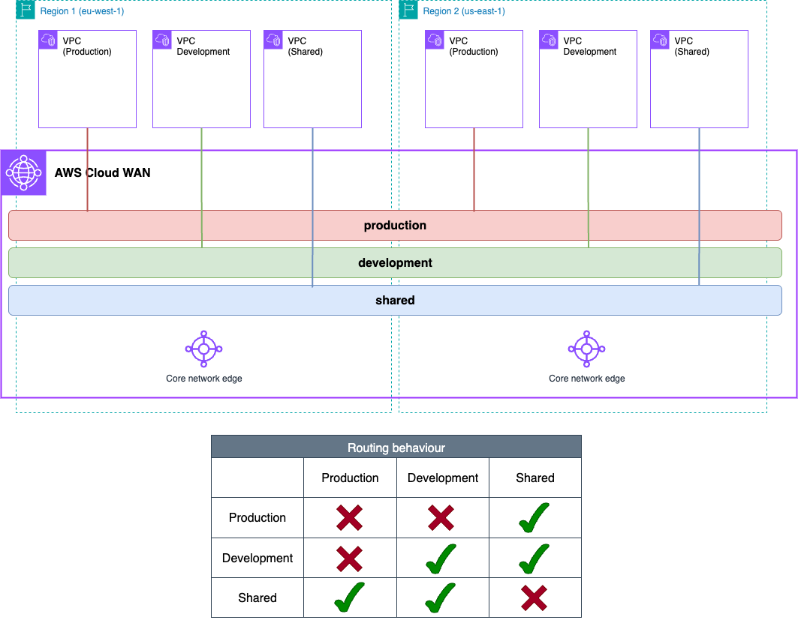

## AWS Cloud WAN Blueprints - Simple architecture

Within this section of the blueprints, we want to provide a simple example of AWS Cloud WAN, so you can understand its basic concepts: segments, segment actions, and attachment policies. The use case covered builds the following:

- Two AWS Regions, three [segments](https://docs.aws.amazon.com/network-manager/latest/cloudwan/cloudwan-policy-segments.html).
    - *production* and *shared* segment are isolated, meaning that VPCs within this segment won't be able to talk between each other.
    - *development* segment, where VPCs will be able to talk between each other within the segment.
- A [share segment action]() will allow VPCs in the *shared* segment to talk with *production* and *development*.
- Two [attachment policies](https://docs.aws.amazon.com/network-manager/latest/cloudwan/cloudwan-policy-attachments.html):
    - First rule (100) will check that the attachment type is VPC, and that the tag with a key `domain` exists. If both conditions are met, it will check the value of the tag `domain`, and it will associate the attachment to a segment with the same name.
    - Second rule (200) will check if the attachment has a tag equals to `domain = sharedservice`. If true, it will associate the attachment to the segment *shared*.

**Note** that in this section we are not covering *service insertion*, as this routing configuration is covered in detail in the [Traffic inspection architectures](../3-traffic_inspection/) section.



```json
{
  "version": "2021.12",
  "core-network-configuration": {
    "vpn-ecmp-support": false,
    "dns-support": true,
    "security-group-referencing-support": false,
    "asn-ranges": [
      "64520-65525"
    ],
    "edge-locations": [
      {
        "location": "eu-west-1"
      },
      {
        "location": "us-east-1"
      }
    ]
  },
  "segments": [
    {
      "name": "development",
      "require-attachment-acceptance": false
    },
    {
      "name": "production",
      "require-attachment-acceptance": false,
      "isolate-attachments": true
    },
    {
      "name": "shared",
      "require-attachment-acceptance": false,
      "isolate-attachments": true
    }
  ],
  "network-function-groups": [],
  "segment-actions": [
    {
      "action": "share",
      "mode": "attachment-route",
      "segment": "shared",
      "share-with": [
        "development",
        "production"
      ]
    }
  ],
  "attachment-policies": [
    {
      "rule-number": 100,
      "condition-logic": "and",
      "conditions": [
        {
          "type": "tag-exists",
          "key": "domain"
        },
        {
          "type": "attachment-type",
          "operator": "equals",
          "value": "vpc"
        }
      ],
      "action": {
        "association-method": "tag",
        "tag-value-of-key": "domain"
      }
    },
    {
      "rule-number": 200,
      "condition-logic": "or",
      "conditions": [
        {
          "type": "tag-value",
          "operator": "equals",
          "key": "domain",
          "value": "sharedservice"
        }
      ],
      "action": {
        "association-method": "constant",
        "segment": "shared"
      }
    }
  ]
}
```
