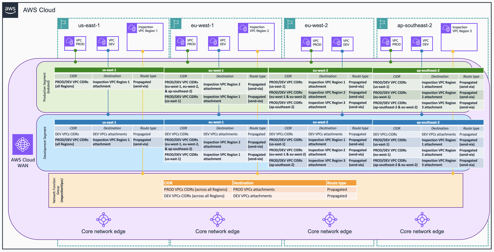

# Service Insertion

Produces **`network-function-groups`** plus **`segment-actions`** entries with `send-to`
or `send-via` — steering traffic through a security appliance.

Cloud WAN does the routing; the appliance does the inspecting. Your policy's job is to
say *which traffic* goes *through which group of appliances*, and in *which Regions*. The
appliance itself is usually AWS Network Firewall, but nothing here depends on that — a
third-party firewall in the same VPC position works identically.

Three things must all be true or inspection silently does not happen. They are covered
below and they are the whole difficulty of this section:

1. The inspection attachments are in a **network function group**, not a segment.
2. For intra-segment inspection, the segment is **isolated**.
3. **Appliance mode** is enabled on the inspection VPC attachment.

## Network function groups

An NFG is a container for inspection attachments. It is *not* a segment, and an
attachment joins one or the other, never both.

```json
{
  "network-function-groups": [
    {
      "name": "inspectionVpcs",
      "require-attachment-acceptance": false
    }
  ]
}
```

NFGs are **global**, like segments — one NFG spans every Region, which is what makes
cross-Region inspection expressible. Attachments join it via an attachment policy:

```json
{
  "attachment-policies": [
    {
      "rule-number": 100,
      "condition-logic": "or",
      "conditions": [
        { "type": "tag-value", "operator": "equals", "key": "inspection", "value": "true" }
      ],
      "action": { "add-to-network-function-group": "inspectionVpcs" }
    }
  ]
}
```

Note the low rule number. An inspection VPC is still a `vpc`, so a later `tag-exists:
domain` rule would happily claim it — the inspection rule has to win. See
[`3-attachment_policies.md`](./3-attachment_policies.md).

You can declare several NFGs when you want different appliance groups for different
traffic classes — an egress firewall estate and an east-west firewall estate, for
example, inspected by different teams' policies.

## `send-to` — egress inspection (north-south)

Sends a segment's internet-bound traffic through the NFG.

```json
{
  "segment-actions": [
    {
      "action": "send-to",
      "segment": "production",
      "via": { "network-function-groups": ["inspectionVpcs"] }
    }
  ]
}
```

That is the whole action. Cloud WAN installs a default route in the segment pointing at
the NFG, the appliance inspects, and egress leaves through the inspection VPC's NAT
gateway and internet gateway.

`send-to` needs no `mode` — there is no multi-hop question for traffic leaving the
network. Repeat the action per segment that needs egress inspection.

> **Expected oddity:** with `send-to` enabled you may see `0.0.0.0/0` and `::/0` shown as
> **blackholed** in the segment's routing information. That is normal. Check the route
> view or `get-network-routes` to confirm the real next hop.

### A Region with no local inspection VPC

If one Region has no inspection VPC, `with-edge-overrides` sends its egress to a Region
that does:

```json
{
  "segment-actions": [
    {
      "action": "send-to",
      "segment": "production",
      "via": {
        "network-function-groups": ["inspectionVpcs"],
        "with-edge-overrides": [
          {
            "edge-sets": [["eu-west-2"]],
            "use-edge-location": "eu-west-1"
          }
        ]
      }
    }
  ]
}
```

Traffic from `eu-west-2` is inspected in `eu-west-1`. This is a deliberate cost trade —
one fewer firewall estate, at the price of cross-Region data transfer and latency on
every egress flow from that Region. It is a good pattern for a small satellite Region and
a bad one for a Region with real egress volume.

## `send-via` — east-west inspection

Sends traffic *between attachments* through the NFG. This is where the design decisions
live.

```json
{
  "segment-actions": [
    {
      "action": "send-via",
      "segment": "production",
      "mode": "dual-hop",
      "when-sent-to": { "segments": "*" },
      "via": { "network-function-groups": ["inspectionVpcs"] }
    }
  ]
}
```

`when-sent-to` scopes it:

| `when-sent-to` | Inspects |
|----------------|----------|
| `{ "segments": "*" }` | Traffic from this segment to **any** segment, including itself |
| `{ "segments": ["development"] }` | Only traffic from this segment to `development` |

Inspecting traffic **within** the segment (`"*"`, or the segment named in the list) is the
case that requires isolation — see below.

## `dual-hop` versus `single-hop`

The only decision unique to `send-via`, and it applies to **cross-Region** traffic.

### `dual-hop`

Cross-Region traffic is inspected in **both** the source and destination Region.

```
VPC (us-east-1) → firewall (us-east-1) → firewall (eu-west-1) → VPC (eu-west-1)
```

- **Requires an inspection attachment in every Region** of the participating segments. A
  Region without one blackholes the traffic.
- Both Regions' security teams see their own traffic, which is often a compliance
  requirement.
- Two inspection hops of latency, and traffic traverses two firewall estates.

### `single-hop`

Traffic traverses **one** inspection attachment on its path.

```
VPC (us-east-1) → firewall (us-east-1) → VPC (eu-west-1)
```

- Cheaper and lower latency.
- Cloud WAN picks the Region from a default priority list unless you say otherwise —
  which you almost always should, because an implicit choice here is a surprise waiting
  to happen.
- Lets a Region without a local inspection VPC participate, by overriding to one that
  has.

Use `with-edge-overrides` to define the choice explicitly:

```json
{
  "segment-actions": [
    {
      "action": "send-via",
      "segment": "production",
      "mode": "single-hop",
      "when-sent-to": { "segments": "*" },
      "via": {
        "network-function-groups": ["inspectionVpcs"],
        "with-edge-overrides": [
          {
            "edge-sets": [["us-east-1", "eu-west-1"]],
            "use-edge-location": "us-east-1"
          }
        ]
      }
    }
  ]
}
```

Each override names a **Region pair** in `edge-sets` and the Region that inspects it.

### The inspection matrix

With more than two Regions you are defining a matrix, and it pays to write it out before
writing JSON. For four Regions where `eu-west-2` has no local inspection:



| Source ↓ / Dest → | us-east-1 | eu-west-1 | eu-west-2 | ap-southeast-2 |
|---|---|---|---|---|
| **us-east-1** | us-east-1 | us-east-1 | us-east-1 | us-east-1 |
| **eu-west-1** | us-east-1 | eu-west-1 | eu-west-1 | eu-west-1 |
| **eu-west-2** | us-east-1 | eu-west-1 | eu-west-1 | ap-southeast-2 |
| **ap-southeast-2** | us-east-1 | eu-west-1 | ap-southeast-2 | ap-southeast-2 |

Expressed as overrides:

```json
{
  "segment-actions": [
    {
      "action": "send-via",
      "segment": "production",
      "mode": "single-hop",
      "when-sent-to": { "segments": "*" },
      "via": {
        "network-function-groups": ["inspectionVpcs"],
        "with-edge-overrides": [
          { "edge-sets": [["us-east-1", "eu-west-1"]], "use-edge-location": "us-east-1" },
          { "edge-sets": [["us-east-1", "ap-southeast-2"]], "use-edge-location": "us-east-1" },
          { "edge-sets": [["ap-southeast-2", "eu-west-1"]], "use-edge-location": "eu-west-1" },
          { "edge-sets": [["eu-west-2", "eu-west-1"]], "use-edge-location": "eu-west-1" },
          { "edge-sets": [["eu-west-2", "us-east-1"]], "use-edge-location": "us-east-1" },
          { "edge-sets": [["ap-southeast-2", "eu-west-2"]], "use-edge-location": "ap-southeast-2" },
          { "edge-sets": [["eu-west-2"]], "use-edge-location": "eu-west-1" }
        ]
      }
    }
  ]
}
```

The last entry has a **single-Region** `edge-sets`: it covers traffic that starts and ends
in `eu-west-2`, which has no local inspection, sending it to `eu-west-1`.

Every Region named must be a declared edge location — `tools/validate_policy.py` checks
this (`ref-4`), and a typo here is otherwise very hard to spot.

> **The [`infra/`](../infra/) patterns deploy two Regions**, so there is one Region pair
> and `single-hop` and `dual-hop` behave almost identically in practice. The matrix above
> is shown as a snippet for that reason. To observe the difference live, extend a pattern
> to three or more Regions — see
> [`infra/README.md`](../infra/README.md#two-regions).

## Isolation is a prerequisite, not an option

**To inspect traffic between attachments in the same segment, that segment must have
`isolate-attachments: true`.**

Without isolation Cloud WAN has a direct route between those attachments and will use it.
The traffic never reaches the appliance. Nothing errors; the firewall logs are just
empty, which reads as "the firewall isn't working" rather than "the policy is wrong".

```json
{
  "segments": [
    {
      "name": "production",
      "require-attachment-acceptance": false,
      "isolate-attachments": true
    }
  ],
  "network-function-groups": [
    { "name": "inspectionVpcs", "require-attachment-acceptance": false }
  ],
  "segment-actions": [
    {
      "action": "send-via",
      "segment": "production",
      "mode": "dual-hop",
      "when-sent-to": { "segments": "*" },
      "via": { "network-function-groups": ["inspectionVpcs"] }
    }
  ]
}
```

`tools/validate_policy.py` treats the missing isolation as an **error** (`cwan-8`), not a
warning, precisely because the failure is invisible at runtime.

Inspecting traffic *between different* segments does not need isolation — there is no
direct route between segments to begin with.

## Appliance mode

Not part of the policy, but inspection does not work without it, so it belongs here.

**Appliance mode must be enabled on the inspection VPC's Cloud WAN attachment.** It
guarantees that both directions of a flow use the same Availability Zone, and therefore
the same firewall endpoint. Without it, the return path can land on a different endpoint,
which has no state for the flow and drops it.

The symptom is characteristic and misleading: connections work sometimes, ICMP succeeds
while TCP hangs, and it appears to depend on which instance you test from. Every
[`infra/`](../infra/) pattern with inspection sets it.

## Combining inspection with route filtering

**Routing policies cannot be attached to a network function group.** This is a documented
Cloud WAN limitation, and it is the single most common thing people try that does not
work.

The workaround is to filter at the **attachment** layer, before traffic enters the
inspection path:

```json
{
  "attachment-routing-policy-rules": [
    {
      "rule-number": 100,
      "conditions": [
        { "type": "routing-policy-label", "value": "vpcAttachments" }
      ],
      "action": { "associate-routing-policies": ["allowCidrRange"] }
    }
  ]
}
```

Routes are filtered as they enter the segment from each VPC attachment; the surviving
routes are then subject to the `send-via` action. The effect you wanted — inspect
traffic, but only for approved prefixes — is achieved, just at a different layer.

`tools/validate_policy.py` errors (`cwan-7`) if a segment action attaches both routing
policies and an NFG. See [`6-routing_policies.md`](./6-routing_policies.md).

## Combining `send-to` and `send-via`

They compose. A common production shape is egress inspection for everything plus
east-west inspection for the sensitive segment:

```json
{
  "segment-actions": [
    {
      "action": "send-to",
      "segment": "production",
      "via": { "network-function-groups": ["inspectionVpcs"] }
    },
    {
      "action": "send-to",
      "segment": "development",
      "via": { "network-function-groups": ["inspectionVpcs"] }
    },
    {
      "action": "send-via",
      "segment": "production",
      "mode": "single-hop",
      "when-sent-to": { "segments": "*" },
      "via": {
        "network-function-groups": ["inspectionVpcs"],
        "with-edge-overrides": [
          { "edge-sets": [["us-east-1", "eu-west-1"]], "use-edge-location": "us-east-1" }
        ]
      }
    }
  ]
}
```

Both segments' egress is inspected; `production`'s east-west traffic is additionally
inspected once per path. Note this needs `production` isolated, and note that
`development` traffic between its own attachments stays direct — which may be exactly
what you want, and should be a decision rather than an oversight.

## Firewall policy is out of scope here

This section is about *getting traffic to* an appliance. What the appliance does is a
separate discipline. The [`infra/`](../infra/) patterns ship deliberately trivial AWS
Network Firewall policies for testing:

- **Egress**: allow HTTPS to `*.amazon.com`, drop everything else.
- **East-west**: alert and allow ICMP, so `ping` demonstrates the path.

Do not treat those as a starting point for production rules.

## Constraints to carry forward

| Constraint | Consequence |
|------------|-------------|
| An attachment is in a segment **or** an NFG | Inspection attachment policy must have a low rule number |
| Isolation **required** for intra-segment inspection | Enforced by `cwan-8`; failure is otherwise invisible |
| Appliance mode required on the inspection VPC | Otherwise asymmetric return paths drop flows |
| `dual-hop` needs inspection in **every** participating Region | Enforced as a warning (`cwan-9`) |
| Routing policies **cannot** attach to an NFG | Enforced by `cwan-7`; filter at the attachment layer |
| Static routes are **not** auto-propagated into NFG route tables | Requires explicit policy configuration |
| `send-to` may show `0.0.0.0/0` blackholed in segment routing info | Expected; check the route view |
| NFG route-table BGP updates can take ~30 minutes to appear in `GetNetworkRoutes` | Forwarding is unaffected |
| Every Region in `with-edge-overrides` must be a declared edge location | Enforced by `ref-4` |

## Next

[`6-routing_policies.md`](./6-routing_policies.md) — fine-grained control over which
routes propagate at all.

## Reference

- [Service insertion](https://docs.aws.amazon.com/network-manager/latest/cloudwan/cloudwan-policy-service-insertion.html)
- [ServiceInsertionAction API](https://docs.aws.amazon.com/networkmanager/latest/APIReference/API_ServiceInsertionAction.html)
- [Cloud WAN FAQs](https://aws.amazon.com/cloud-wan/faqs/)
