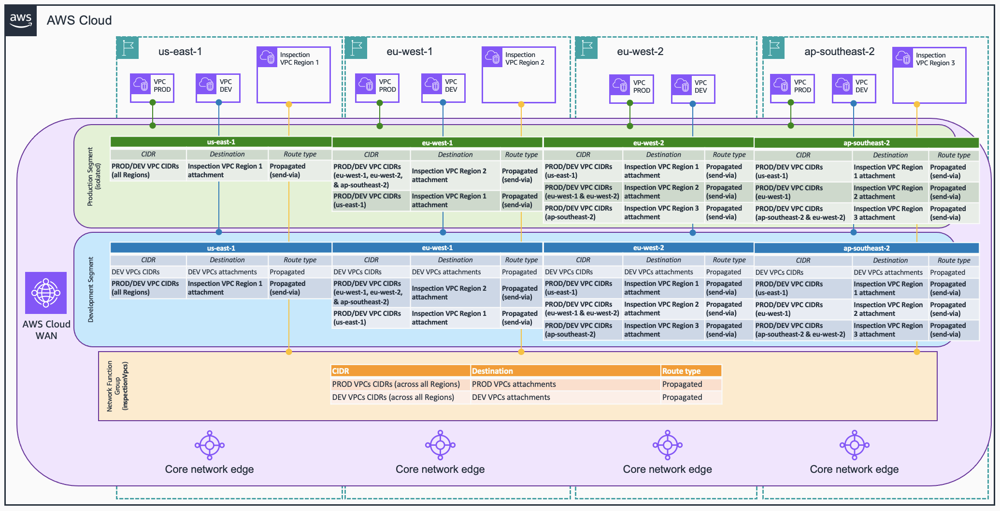

# East/West traffic, with both Spoke VPCs and Inspection VPCs attached to AWS Cloud WAN

## Multi-Region Dual-hop inspection (both AWS Regions)

## Multi-Region Single-hop inspection (single AWS Regions)

In the example in this repository, the following matrix is used to determine which inspection VPC is used for traffic inspection:

| *AWS Region*       | us-east-1 | eu-west-1 | ap-southeast-2 |
| --------------     |:---------:| ---------:| --------------:|
| **us-east-1**      | us-east-1 | us-east-1 | us-east-1      |
| **eu-west-1**      | us-east-1 | eu-west-1 | eu-west-1      |
| **ap-southeast-2** | us-east-1 | eu-west-1 | ap-southeast-2 |

## Prerequisites
- An AWS account with an IAM user with the appropriate permissions
- Terraform installed

## Code Principles:
- Writing DRY (Do No Repeat Yourself) code using a modular design pattern

## Usage
- Clone the repository
- (Optional) Edit the variables.tf file in the project root directory - if you want to test with different parameters.
- You will find three Core Network policy documents.
    - `base_policy.json` is used to create the resources without the Service Insertion actions. This is done because a Service Insertion action cannot reference a Network Function Group that has to attachments associated. This policy is handled by the `aws_networkmanager_core_network` resource.
    - `cloudwan_policy_dualhop.json` contains the final format of the policy document, with the Service Insertion actions. The `aws_networkmanager_core_network_policy_attachment` updates the policy document.
    - If you want to see the single-hop behaviour, change line 7 in the `main.tf` file to use the `cloudwan_policy_singlehop.json` file.
- Deploy the resources using `terraform apply`.
- Remember to clean up resoures once you are done by using `terraform destroy`.

**Note** EC2 instances, VPC endpoints, and AWS Network Firewall endpoints will be deployed in all the Availability Zones configured for each VPC. Keep this in mind when testing this environment from a cost perspective - for production environments, we recommend the use of at least 2 AZs for high-availability.
