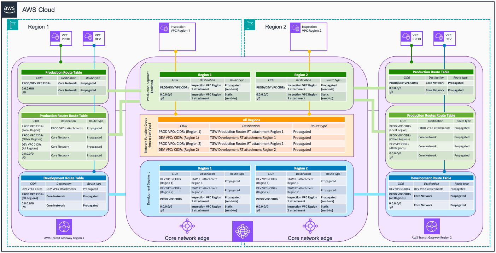

# East/West traffic, with Spoke VPCs attached to a peered AWS Transit Gateway and Inspection VPCs attached to AWS Cloud WAN

## Prerequisites
- An AWS account with an IAM user with the appropriate permissions
- Terraform installed

## Code Principles:
- Writing DRY (Do No Repeat Yourself) code using a modular design pattern

## Usage
- Clone the repository
- (Optional) Edit the variables.tf file in the project root directory - if you want to test with different parameters.
- Deploy the resources using `terraform apply`.
- Remember to clean up resoures once you are done by using `terraform destroy`.
- You will find two Core Network policy documents.
    - `base_policy.json` is used to create the resources without the Service Insertion actions. This is done because a Service Insertion action cannot reference a Network Function Group that has to attachments associated. This policy is handled by the `aws_networkmanager_core_network` resource.
    - `cloudwan_policy.json` contains the final format of the policy document, with the Service Insertion actions. The `aws_networkmanager_core_network_policy_attachment` updates the policy document.

**Note** EC2 instances, VPC endpoints, and AWS Network Firewall endpoints will be deployed in all the Availability Zones configured for each VPC. Keep this in mind when testing this environment from a cost perspective - for production environments, we recommend the use of at least 2 AZs for high-availability.
